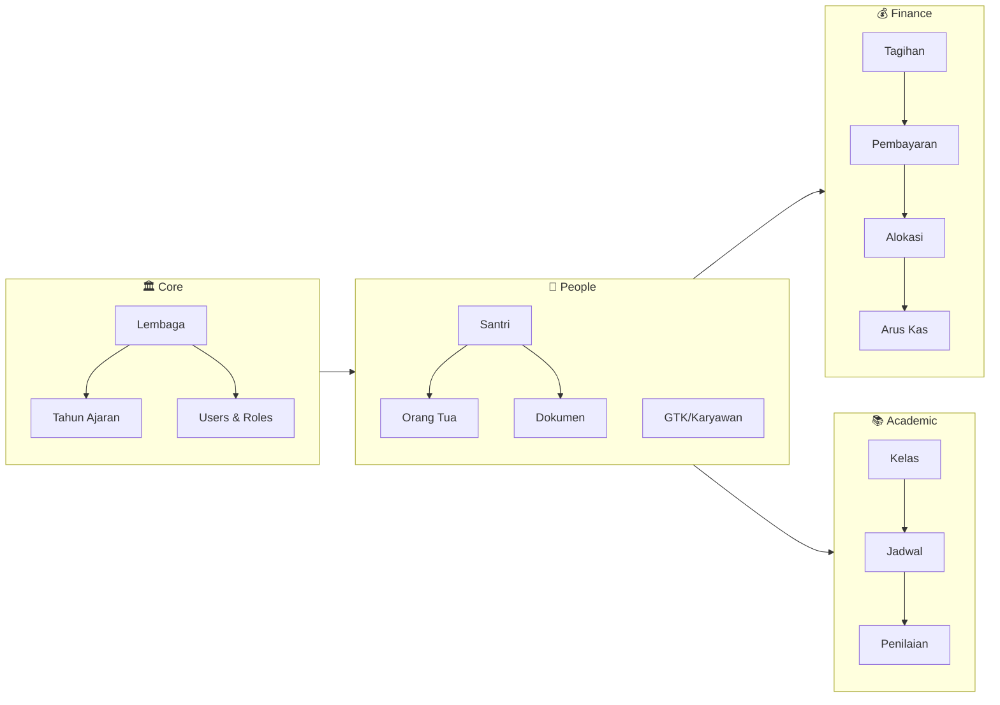

# Modul & Fitur - Super App Dar Al Tauhid

> Dokumentasi lengkap tentang modul dan fitur aplikasi.

**Dokumentasi Terkait:**

- [App Overview](./APP_DARALTAUHID.md)
- [Database Schema](./DATABASE_SCHEMA.md)
- [Tech Stack](./TECHSTACK.md)

---

## Overview Modul

---

## 1. 🏛️ Data Master (Core)

Fondasi data untuk seluruh sistem.

### 1.1 Manajemen Lembaga

**Daftar Lembaga di bawah Naungan Yayasan:**

| Kode       | Nama Lembaga                   | Jenjang        | Keterangan                               |
| :--------- | :----------------------------- | :------------- | :--------------------------------------- |
| **YYS**    | Yayasan Dar Al Tauhid Pusat    | Yayasan        | Kantor Pusat / Manajemen Aset            |
| **PPDT**   | Pondok Pesantren Dar Al Tauhid | Non-Formal     | Pendiidikan Agama, Asrama & Kepengasuhan |
| **MDT**    | Madrasah Diniyah Dar Al Tauhid | Non-Formal     | Pendidikan Agama                         |
| **SMPPDT** | SMP Plus Dar Al Tauhid         | Formal (SMP)   | Sekolah Menengah Pertama                 |
| **MANUS**  | MAS Nusantara Arjawinangun     | Formal (MA)    | Madrasah Aliyah                          |
| **MISDT**  | MIS Dar Al Tauhid              | Formal (SD/MI) | Madrasah Ibtidaiyah                      |

> **MTsN 3 Cirebon:** Sekolah Negeri yang bekerjasama dengan Yayasan Dar Al Tauhid Pusat

- **Profil Lembaga:** Logo, alamat, NPSN, website, kontak
- **Hierarki:** Yayasan sebagai pusat, Lembaga sebagai cabang

### 1.2 Manajemen Tahun Ajaran

- **Periode Aktif:** Hanya 1 tahun ajaran aktif per waktu
- **Semester:** Ganjil/Genap dengan tanggal mulai & selesai
- **Auto-Generate:** Tagihan otomatis saat tahun ajaran baru

### 1.3 Data Induk Santri

| Fitur           | Deskripsi                                            |
| --------------- | ---------------------------------------------------- |
| Biodata Lengkap | NIK, NISN, NISY (Buku Induk), TTL, Alamat            |
| Data Keluarga   | Ayah, Ibu, Wali (pekerjaan, pendidikan, penghasilan) |
| Multi-Lembaga   | 1 santri bisa terdaftar di Pondok + SMP + Madrasah   |
| Status Tracking | draft → verified → active → graduated/moved/dropped  |
| Dokumen Digital | Upload KK, Akta, Ijazah, Foto (validasi status)      |

### 1.4 Data GTK (Guru & Tenaga Kependidikan)

- **Biodata:** NIP, NIK, status kepegawaian (tetap/kontrak/honorer)
- **Keuangan:** Gaji pokok, rekening bank
- **Arsip Digital:** Scan SK, Ijazah (path dokumen)
- **Multi-Profil:** 1 user bisa punya banyak profil pegawai di lembaga berbeda

### 1.5 Roles & Permissions

- **Role-Based Access:** Super Admin, Admin Lembaga, Bendahara, Guru, Wali Kelas, Wali Santri
- **Custom Roles & Permissions:** Custom roles & permissions via Spatie Roles & Permissions
- **Laravel Middleware:** Permission check via custom middleware & Gate policies
- **Multi-Tenancy:** Admin Lembaga hanya lihat data lembaganya (filter by `institution_id`)

---

## 2. 📝 Modul PSB (Penerimaan Santri Baru)

### 2.1 Formulir Pendaftaran

| Jalur / Channel  | Metode Input                                               | Cakupan Lembaga                                                                                | Keterangan                                                                    |
| :--------------- | :--------------------------------------------------------- | :--------------------------------------------------------------------------------------------- | :---------------------------------------------------------------------------- |
| **PSB Pusat**    | • Web: `psb.daraltauhid.com` • Manual: Panitia PSB      | ✅ **Pondok Pesantren** ✅ **Madrasah** ✅ **Sekolah Formal** (Pilih SMP/MTs/MA) | Santri otomatis **Mondok (Mukim)**. Satu akun untuk semua lembaga dan asrama. |
| **Sekolah** | • Web: `[unit].daraltauhid.com` • Manual: Admin Sekolah |✅ **Hanya Sekolah Terkait**             | Santri **Pulang Pergi (Non-Mukim)**. Hanya terdaftar di sekolah tersebut.     |

### 2.2 Fitur Pendaftaran

- **Kelas Tujuan:**
    - **MISDT:** 1, 2, 3, 4, 5, 6
    - **SMPPDT:** 7, 8, 9
    - **MANUS:** 10, 11, 12
- **Sumber Biaya:** Orang Tua, Beasiswa, Biaya Sendiri

### 2.3 Dokumen & Verifikasi

- **Upload Wajib:** Foto, Akta, Kartu Keluarga, Ijazah/SKHU
- **Status Validasi:** Pending → Valid / Invalid (dengan catatan)
- **Re-upload:** Wali bisa upload ulang jika ditolak

### 2.4 Output & Notifikasi

- **Bukti Pendaftaran:** PDF dengan nomor registrasi & QR Code
- **Notifikasi WA:** Status pendaftaran, reminder bayar, pengumuman

### 2.5 Dashboard Cek Status

- **Login Peserta:** Cek status kelulusan, tagihan, dan pembayaran
- **Progress Bar:** Visualisasi kelengkapan dokumen

### 2.6 Auto-Generate Tagihan

> Saat santri didaftarkan, sistem otomatis membuat tagihan berdasarkan `fee_components` yang aktif untuk lembaga & tahun ajaran tersebut.

---

## 3. 💰 Modul Keuangan

### 3.1 Master Data Keuangan

#### 3.1.1 Rekening/Dompet Kas (`financial_accounts`)

- **Multi-Rekening:** Kas Tunai TU, Bank BSI, Bank BJB per lembaga
- **Balance Caching:** Saldo otomatis update via Observer
- **Recalculate:** Fitur reset saldo dari total mutasi (hidden in Settings)

#### 3.1.2 Pos Anggaran (`budget_categories`)

- **Chart of Account:** Kode akun hierarkis (4.1 Pemasukan, 5.1 Pengeluaran)
- **Type:** Income (Masuk) / Expense (Keluar)
- **Per-Lembaga:** Setiap lembaga punya pos anggaran sendiri

#### 3.1.3 Komponen Biaya (`fee_components`)

| Field         | Contoh                          |
| ------------- | ------------------------------- |
| Nama          | SPP, Uang Gedung, Seragam, Buku |
| Tipe          | Monthly, Yearly, Once           |
| Target Kelas  | Kelas 7 / 8 / 9 / Semua         |
| Target Gender | L / P / Semua                   |

### 3.2 Tagihan Santri (`bills`)

- **Auto-Generate:** Saat santri mendaftar via `Student::generateBills()`
- **Discount:** `initial_amount` - `discount_amount` = `amount`
- **Status:** Unpaid → Partial → Paid / Cancelled
- **Periode:** Bulan & Tahun tagihan (untuk SPP bulanan)

### 3.3 Pembayaran (`payments`)

| Fitur            | Deskripsi                               |
| ---------------- | --------------------------------------- |
| **Lokasi Input** | PANITIA (Pusat) atau LEMBAGA (Langsung) |
| **Metode**       | Cash / Transfer                         |
| **Status**       | Pending → Success / Failed              |
| **Kwitansi**     | Cetak PDF dengan QR Code verifikasi     |
| **Bukti**        | Upload foto bukti transfer              |

### 3.4 Alokasi Pembayaran (`payment_allocations`)

> **PENTING:** 1x bayar bisa dialokasikan ke banyak tagihan!

Contoh: Bayar Rp 1.000.000 dialokasikan ke:

- SPP Januari: Rp 200.000
- SPP Februari: Rp 200.000
- Uang Gedung (Cicilan): Rp 600.000

### 3.5 Saldo Santri (`student_wallets`)

- **Kelebihan Bayar:** Jika bayar lebih, masuk ke saldo
- **Potong Otomatis:** Saldo bisa dipotong untuk tagihan berikutnya

### 3.6 Pengeluaran Lembaga (`expenses`)

- **Input:** Judul, deskripsi, nominal, bukti nota
- **Approval:** Pending → Approved / Rejected
- **Pos Anggaran:** Kategorisasi (Listrik, ATK, Honor, dll)

### 3.7 Pemasukan Non-Santri (`incomes`)

- **Sumber:** Hibah, Donasi, Bantuan Pemerintah
- **Tracking:** Dari siapa, untuk apa, berapa

### 3.8 Arus Kas / Jurnal (`cash_mutations`)

> **Tabel Inti:** Semua pergerakan uang tercatat di sini!

| Fitur                | Deskripsi                                                   |
| -------------------- | ----------------------------------------------------------- |
| **Polymorphic**      | Link ke `payments`, `expenses`, `incomes`, `fund_transfers` |
| **Balance Snapshot** | `balance_after` = saldo setelah transaksi                   |
| **Bukti**            | Foto nota/kuitansi                                          |

### 3.9 Distribusi Dana (`fund_transfers`)

> **Flow:** Dana dari Panitia Pusat → Lembaga

- **Status:** Pending → Approved → Completed / Rejected
- **Approval:** Siapa yang approve, kapan
- **Receipt:** Siapa yang terima, kapan

### 3.10 WhatsApp Billing

- **Auto-Reminder:** Kirim tagihan via Fonnte (Cron Job)
- **Template:** Salam, detail tagihan, total, link bayar

### 3.11 Laporan Keuangan

| Laporan                  | Deskripsi                        |
| ------------------------ | -------------------------------- |
| Rekapitulasi Pemasukan   | Per hari/minggu/bulan/tahun      |
| Rekapitulasi Pengeluaran | Per pos anggaran                 |
| Tunggakan Santri         | List santri dengan sisa tagihan  |
| Arus Kas                 | Jurnal masuk-keluar per rekening |
| Neraca Saldo             | Total saldo semua rekening       |

---

## 4. 🏠 Modul Kesantrian

### 4.1 E-Izin (soon)

- **Input Izin:** Tipe (Sakit/Izin), tanggal mulai-selesai, alasan
- **Approval:** Pending → Approved
- **Surat Jalan:** Cetak surat izin keluar
- **Notifikasi WA:** Kirim ke ortu saat santri keluar/pulang

### 4.2 Poin & Pelanggaran

- **Pencatatan:** Nama pelanggaran, poin, hukuman/takzir
- **Grafik:** Visualisasi perilaku santri per bulan
- **Alert:** Notifikasi jika poin mencapai batas

### 4.3 Poskestren (soon)

- **Rekam Medis:** Riwayat sakit, alergi, golongan darah
- **Kunjungan:** Log kunjungan ke UKS

### 4.4 Manajemen Asrama

- **Mapping Kamar:** Santri → Kamar → Gedung
- **Fasilitas:** Lemari, kasur, dll

---

## 5. 📚 Modul Akademik

### 5.1 Manajemen Kelas (Rombel)

- **Mapping:** Santri → Kelas → Tahun Ajaran
- **Wali Kelas:** Assign guru sebagai wali kelas
- **Status:** Active / Moved

### 5.2 Mata Pelajaran

- **Per-Lembaga:** Setiap lembaga punya daftar mapel sendiri
- **Kode Mapel:** Untuk identifikasi

### 5.3 Jadwal Pelajaran

- **Plotting:** Guru → Mapel → Kelas → Hari → Jam
- **Deteksi Bentrok:** Alert jika guru/kelas sudah terisi

### 5.4 Buku Prestasi Tahfidz

| Field        | Deskripsi          |
| ------------ | ------------------ |
| Surah & Ayat | Awal - Akhir       |
| Kualitas     | Lancar / Kurang    |
| Guru Penguji | Siapa yang menguji |
| Tanggal      | Kapan setoran      |

### 5.5 Penilaian Akademik

- **Jenis:** UH, UTS, UAS
- **Per-Mapel:** Nilai per mata pelajaran
- **Relasi:** Student Class → Subject → Assessment

### 5.6 E-Rapor (Future)

- **Kurikulum Merdeka:** Support P5
- **Output:** Web View (HTML) & PDF
- **Per-Semester:** Generate rapor per periode

---

## 6. ⏰ Modul Presensi (Attendance)

### 6.1 Presensi Santri

| Metode          | Deskripsi                      |
| --------------- | ------------------------------ |
| **Manual**      | Input langsung oleh petugas    |
| **QR Code**     | Scan via webcam/HP admin       |
| **Fingerprint** | Sinkronisasi dari mesin absen  |
| **Face ID**     | Integrasi recognition (Future) |

- **Status:** Present, Late, Alpha, Sick, Permit
- **Jam Masuk:** Timestamp kehadiran

### 6.2 Presensi GTK

- **GPS Geofencing:** Validasi radius dari titik sekolah
- **Jam Masuk/Keluar:** Clock in & clock out
- **Latitude/Longitude:** Bukti lokasi

---

## 7. 👨‍🏫 Modul GTK & Payroll

### 7.1 Arsip Digital

- **Dokumen:** SK Pengangkatan, Ijazah, Sertifikat
- **Storage:** Path file di sistem

### 7.2 Payroll System

| Fitur             | Deskripsi                                                     |
| ----------------- | ------------------------------------------------------------- |
| **Komponen Gaji** | Gaji Pokok + Tunjangan + Jam Mengajar - Potongan              |
| **Auto-Generate** | Hitung otomatis berdasarkan kehadiran                         |
| **Snapshot**      | Data gaji disimpan statis (tidak berubah jika master berubah) |
| **Slip Gaji**     | PDF dengan rincian komponen                                   |
| **Status**        | Draft → Paid                                                  |

---

## 8. 📊 Modul Surat Menyurat & Arsip Digital

### 8.1 Manajemen Surat Masuk

- **Input Metadata:** Input nomor, pengirim, tanggal, perihal.
- **Hybrid Storage:** File fisik upload langsung ke Google Drive via API.
- **Indeksasi Penerima:** Indeksasi penerima.

### 8.2 Manajemen Surat Keluar

- **Penomoran Otomatis:** Penomoran otomatis (Auto-Numbering) format baku.
- **Generator Template PDF:** Generator template PDF (SK, Surat Tugas) via library ringan.
- **Draf & Approval Flow:** Draf & approval flow.
- **Tanda Tangan Digital:** Tanda Tangan Digital (QR Code Validation).

### 8.3 Disposisi Digital

- **UI Responsif:** UI Responsif (Livewire/MaryUI) untuk disposisi berjenjang.
- **Notifikasi Real-time:** Notifikasi Real-time via WhatsApp (Fonnte).
- **Tracking Status:** Tracking status surat.

### 8.4 Manajemen Arsip & Retensi
- **Pencarian Metadata:** Pencarian Metadata (Smart Search) via SQL Indexing.
- **Jadwal Retensi Arsip:** Jadwal Retensi Arsip (Cron Job/Scheduler) untuk pemindahan ke arsip inaktif.

### 8.5 Keamanan & Log
- **Role-Based Access Control:** Role-Based Access Control (RBAC).
- **Audit Trail:** Audit Trail (Log aktivitas user).

## 9. 👨‍👩‍👧 Modul Wali Santri (Mobile View)

Portal khusus untuk wali santri dengan akses:

### 9.1 Keuangan

- **Tagihan:** List tagihan aktif dengan status
- **Riwayat Bayar:** History pembayaran
- **Saldo:** Kelebihan bayar yang tersisa

### 9.2 Akademik

- **Kehadiran:** Rekap presensi per bulan
- **Tahfidz:** Progress hafalan
- **Nilai:** Hasil penilaian (jika tersedia)

### 9.3 Kesantrian

- **Izin:** Status izin yang diajukan
- **Pelanggaran:** Catatan pelanggaran & poin

### 9.4 Dokumen

- **Status Dokumen:** Valid / Invalid / Pending
- **Re-upload:** Upload ulang jika ditolak

---

## 10. Roadmap Fitur

| Phase | Modul                          | Status         |
| ----- | ------------------------------ | -------------- |
| 1     | Core Data, PSB, Keuangan Dasar | 📋 Planned     |
| 2     | Akademik, Presensi Santri      | 📋 Planned |
| 3     | Payroll, Presensi GTK          | 📋 Planned     |
| 4     | Kesantrian Lengkap             | 📋 Planned     |
| 5     | E-Rapor, Analytics             | 📋 Planned     |

---

_Dokumentasi ini terakhir diperbarui pada: Januari 2026_
